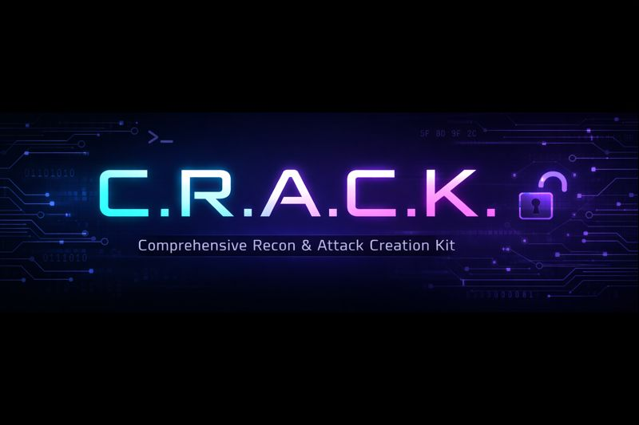

<p align="center">
  
</p>

<h1 align="center">🔓 C.R.A.C.K.</h1>

<h3 align="center">
  <strong>C</strong>omprehensive <strong>R</strong>econ & <strong>A</strong>ttack <strong>C</strong>reation <strong>K</strong>it
</h3>

<p align="center">
  <em>The professional penetration testing toolkit that thinks like you do.</em>
</p>

<p align="center">
  <a href="https://www.python.org/downloads/"></a>
  <a href="https://opensource.org/licenses/MIT"></a>
  <a href="#"></a>
  <a href="#"></a>
</p>

<p align="center">
  <a href="#-quick-start">Quick Start</a> •
  <a href="#-features">Features</a> •
  <a href="#-cli-commands">CLI</a> •
  <a href="#%EF%B8%8F-gui-applications">GUI</a> •
  <a href="#-mcp-integration">MCP</a> •
  <a href="#-documentation">Docs</a>
</p>

---

<p align="center">
  <code>🔧 1,487 Commands</code> &nbsp;•&nbsp;
  <code>⛓️ 32 Attack Chains</code> &nbsp;•&nbsp;
  <code>📚 50 Cheatsheets</code> &nbsp;•&nbsp;
  <code>🤖 15 MCP Tools</code>
</p>

---

## 🎯 Why CRACK?

> **"Failed attempts documented well teach more than lucky successes explained poorly."**

CRACK is not just another pentesting toolkit—it's a **complete assessment ecosystem** designed for professionals who need:

| Feature | What It Does |
|---------|--------------|
| 🖥️ **Three Interfaces** | CLI for automation, GUIs for visualization, MCP for AI assistance |
| 📖 **Deep Documentation** | Every command has flag explanations, use cases, and alternatives |
| 🔗 **Graph Relationships** | Neo4j-powered connections between commands, prerequisites, and next steps |
| 📊 **Engagement Tracking** | Built-in target, credential, and finding management |
| 🧠 **AI-Ready** | MCP server integrates directly with Claude Code for intelligent workflows |

---

## 📋 Table of Contents

- [🚀 Quick Start](#-quick-start)
- [✨ Features](#-features)
- [💻 CLI Commands](#-cli-commands)
- [🖥️ GUI Applications](#%EF%B8%8F-gui-applications)
- [🤖 MCP Integration](#-mcp-integration)
- [📚 Knowledge Base](#-knowledge-base)
- [🏗️ Architecture](#%EF%B8%8F-architecture)
- [⚙️ Configuration](#%EF%B8%8F-configuration)
- [🤝 Contributing](#-contributing)
- [📄 License](#-license)

---

## 🚀 Quick Start

### One-Command Setup

```bash
git clone https://github.com/CodeBlackwell/C.R.A.C.K..git crack
cd crack
just setup
```

This installs everything: CLI tools, GUI apps, Neo4j database, and verifies the installation.

<details>
<summary>📦 <strong>Don't have <code>just</code>?</strong></summary>

Install the `just` command runner first:

```bash
# Kali/Debian
sudo apt install just

# macOS
brew install just

# Other platforms
cargo install just
```

</details>

### CLI Only (Lightweight)

```bash
git clone https://github.com/CodeBlackwell/C.R.A.C.K..git crack
cd crack
just install
```

### Verify Installation

```bash
just verify
```

---

## ✨ Features

<table>
<tr>
<td width="33%" valign="top">

### 🔍 Command Reference
**1,487 penetration testing commands** with:
- Complete flag explanations
- Variables with examples
- Success/failure indicators
- Alternative approaches
- Prerequisites & next steps

</td>
<td width="33%" valign="top">

### ⛓️ Attack Chains
**32 ordered attack workflows**:
- Active Directory attacks
- Lateral movement paths
- Privilege escalation
- Post-exploitation flows
- Web exploitation chains

</td>
<td width="33%" valign="top">

### 📚 Cheatsheets
**50 educational collections**:
- Password attacks
- Pivoting techniques
- AV evasion methods
- One-liners reference
- Service exploitation

</td>
</tr>
<tr>
<td valign="top">

### 🖥️ Crackpedia
Visual command encyclopedia with:
- Full-text search
- Graph visualization
- Relationship mapping
- Keyboard navigation

</td>
<td valign="top">

### 🎯 B.R.E.A.C.H.
Pentesting workspace with:
- Terminal multiplexer
- Credential vault
- Loot tracking
- Target sidebar
- Engagement scope

</td>
<td valign="top">

### 🤖 Claude MCP
AI-assisted pentesting with:
- Command lookup
- Chain execution
- Engagement updates
- Next step suggestions

</td>
</tr>
<tr>
<td valign="top">

### 🗃️ Neo4j Backend
Graph-powered intelligence:
- Command relationships
- Attack path queries
- Engagement data
- BloodHound integration

</td>
<td valign="top">

### 📊 Engagement Tracking
Professional workflow management:
- Target registration
- Service enumeration
- Finding documentation
- Credential storage

</td>
<td valign="top">

### ⚙️ 77 Variables
Configurable placeholders:
- Network (LHOST, TARGET)
- Web testing (WORDLIST)
- Credentials (USER, PASS)
- Auto-detection support

</td>
</tr>
</table>

---

## 💻 CLI Commands

### Network & Enumeration

| Command | Description | Example |
|---------|-------------|---------|
| `crack port-scan` | Two-stage port scanning | `crack port-scan 10.10.10.100` |
| `crack enum-scan` | Fast enumeration + CVE lookup | `crack enum-scan 10.10.10.100` |
| `crack dns-enum` | Recursive DNS enumeration | `crack dns-enum example.com` |

### Web Application Testing

| Command | Description | Example |
|---------|-------------|---------|
| `crack html-enum` | Extract forms, comments, endpoints | `crack html-enum http://target/` |
| `crack param-discover` | Find hidden parameters | `crack param-discover http://target/page` |
| `crack sqli-scan` | SQL injection detection | `crack sqli-scan http://target/page?id=1` |
| `crack sqli-fu` | SQLi post-exploitation reference | `crack sqli-fu mysql` |

### Active Directory

| Command | Description | Example |
|---------|-------------|---------|
| `crack bloodtrail` | BloodHound attack path analysis | `crack bloodtrail analyze` |

### Post-Exploitation

| Command | Description | Example |
|---------|-------------|---------|
| `crack prism` | Parse tool output (mimikatz, nmap, ldap) | `crack prism mimikatz.txt` |
| `crack session` | Reverse shell listener management | `crack session listen 4444` |

### Reference System

| Command | Description | Example |
|---------|-------------|---------|
| `crack reference` | Command lookup with explanations | `crack reference nmap` |
| `crack cheatsheets` | Interactive educational collections | `crack cheatsheets` |
| `crack config` | Variable management | `crack config set LHOST 10.10.14.5` |

### Engagement Tracking

| Command | Description | Example |
|---------|-------------|---------|
| `crack engagement` | Engagement management | `crack engagement create "Lab Pentest"` |
| `crack target` | Target IP/hostname tracking | `crack target add 10.10.10.100` |
| `crack finding` | Vulnerability documentation | `crack finding add "SQLi" --severity critical` |

<details>
<summary>📋 <strong>View All Just Commands</strong></summary>

| Command | Description |
|---------|-------------|
| `just setup` | Full installation with Neo4j |
| `just install` | CLI + GUI installation only |
| `just verify` | Check installation status |
| `just info` | Show environment info |
| `just neo4j-start` | Start Neo4j database |
| `just neo4j-stop` | Stop Neo4j database |
| `just dev` | Development environment setup |
| `just test` | Run test suite |
| `just mcp-config` | Show MCP server config |
| `just crackpedia-dev` | Crackpedia hot reload |
| `just breach-dev` | B.R.E.A.C.H. hot reload |

Run `just --list` for all available commands.

</details>

---

## 🖥️ GUI Applications

### Crackpedia — Command Encyclopedia

<p align="center">
  <em>Visual exploration of 1,487 penetration testing commands</em>
</p>

```bash
crackpedia
```

**Features:**
- 🔍 **Full-text search** across all commands
- 📊 **Graph visualization** showing command relationships
- ⌨️ **Keyboard navigation** (↑↓ arrows, Enter to select)
- 🔗 **Relationship mapping** (alternatives, prerequisites, next steps)
- 🏷️ **Tag filtering** by category, platform, priority

**Tech Stack:** Electron 28 • React 18 • TypeScript • Cytoscape.js • Neo4j

---

### B.R.E.A.C.H. — Pentesting Workspace

<p align="center">
  <em>Terminal multiplexer with integrated engagement tracking</em>
</p>

```bash
crack breach
# or
cd breach && ./start.sh
```

**Features:**
- 💻 **Terminal multiplexer** with xterm.js + node-pty
- 🎯 **Engagement selector** (switch between assessments)
- 🔑 **Credential vault** (discovered creds with "Use" action)
- 🏆 **Loot tracking** (flags, SSH keys, configs)
- 📋 **Target sidebar** (machines by status)

**Tech Stack:** Electron 28 • React 18 • TypeScript • xterm.js • Neo4j

---

## 🤖 MCP Integration

CRACK includes an **MCP (Model Context Protocol) server** for Claude Code integration, enabling AI-assisted penetration testing workflows.

### Setup

Add to your `~/.claude.json`:

```json
{
  "mcpServers": {
    "crack": {
      "command": "python3",
      "args": ["/path/to/crack/mcpserver/server.py"],
      "env": {
        "NEO4J_URI": "bolt://localhost:7687",
        "NEO4J_PASSWORD": "your_password"
      }
    }
  }
}
```

### Available Tools (15)

<table>
<tr>
<td width="50%" valign="top">

**Knowledge Tools**
| Tool | Description |
|------|-------------|
| `search_commands` | Search 1,487 commands |
| `get_command` | Full command details |
| `fill_command` | Substitute placeholders |
| `get_cheatsheet` | Educational collections |
| `get_attack_chain` | Ordered workflow steps |
| `suggest_next_steps` | Recommended follow-ups |

</td>
<td width="50%" valign="top">

**Engagement Tools**
| Tool | Description |
|------|-------------|
| `get_engagement_context` | Current status |
| `add_target` | Register target |
| `add_finding` | Record vulnerability |
| `add_credential` | Store credential |
| `get_target_graph` | Target relationships |
| `get_engagement_relationships` | Cross-node summary |

</td>
</tr>
</table>

**Configuration Tools:** `list_configured_variables`, `describe_variable`, `get_server_info`

### Example Workflow

```
You: Search for commands related to AS-REP roasting

Claude: [Uses search_commands tool]
Found 3 commands:
- impacket-getnpusers: Get AS-REP hashes for users without pre-authentication
- hashcat-asrep: Crack AS-REP hashes with hashcat
- ...

You: Get the attack chain for AS-REP roasting

Claude: [Uses get_attack_chain tool]
Chain: ad-asreproast-full (Medium difficulty, 15-30 min)
Step 1: Enumerate users without pre-auth
Step 2: Extract AS-REP hashes
Step 3: Crack hashes offline
...
```

---

## 📚 Knowledge Base

### Commands by Category

<table>
<tr>
<td width="50%">

| Category | Commands |
|----------|----------|
| 🏰 Active Directory | 27 |
| 🔓 Post-Exploitation | 30 |
| 🔍 Enumeration | 20 |
| 💥 Exploitation | 22 |
| 🌐 Web | 11 |
| 📡 Monitoring | 9 |
| 🛡️ AV Evasion | 8 |
| 📁 File Transfer | 7 |

</td>
<td width="50%">

| Category | Commands |
|----------|----------|
| 🔀 Lateral Movement | 4 |
| 🔗 Pivoting | 7 |
| 🛠️ Utilities | 9 |
| 🐚 Shells | 2 |
| 🖥️ Generated | 9 |
| **Total** | **1,487** |

</td>
</tr>
</table>

### Attack Chains

| Category | Chains | Examples |
|----------|--------|----------|
| 🏰 Active Directory | 11 | AS-REP Roasting, Kerberoasting, DCSync, Password Spray |
| 🔀 Lateral Movement | 7 | PsExec, WinRM, WMI, DCOM, Pass-the-Hash |
| 📈 Privilege Escalation | 5 | Linux SUID, sudo, Windows Token, UAC Bypass |
| 🔓 Post-Exploitation | 3 | Mimikatz workflows, VSS extraction |
| 🔍 Enumeration | 2 | Web SQLi, Custom Cypher |
| 🌐 Web Exploitation | 4 | CrushFTP, File Upload, LFI chains |

### Cheatsheets

<details>
<summary>📖 <strong>View All Cheatsheet Categories</strong></summary>

- **Active Directory** — AD enumeration, attacks, and defense
- **AV Evasion** — Signature, heuristic, and AMSI bypass
- **Metasploit** — Framework usage and modules
- **One-Liners** — Quick reference commands
- **Password Attacks** — Cracking, spraying, stuffing
- **Pivoting** — SSH tunnels, proxychains, chisel
- **Post-Exploitation** — Linux and Windows privesc
- **PowerShell** — Offensive PS techniques
- **Reconnaissance** — Initial enumeration
- **Utilities** — File ops, encoding, networking
- **Web Exploitation** — SQL injection, XSS, file upload

</details>

---

## 🏗️ Architecture

```
crack/
├── 📄 cli.py              # Main entry point
├── 📁 core/               # Configuration, themes, utilities
│   └── config/            # 77-variable management system
├── 📁 tools/
│   ├── recon/             # Port scanning, web enum, SQLi
│   ├── post/              # BloodTrail, PRISM, Sessions
│   └── engagement/        # Target and finding management
├── 📁 reference/          # Command reference system
│   ├── core/              # Registry, backends, adapters
│   └── chains/            # Attack chain definitions
├── 📁 db/                 # Knowledge base
│   ├── data/              # JSON commands, chains, cheatsheets
│   └── neo4j-migration/   # Graph database import
├── 📁 crackpedia/         # Electron command encyclopedia
├── 📁 breach/             # Electron pentesting workspace
└── 📁 mcpserver/          # Claude Code MCP integration
```

### Data Flow

```
┌─────────────┐     ┌─────────────┐     ┌─────────────┐
│    CLI      │     │    GUI      │     │    MCP      │
│  (Python)   │     │ (Electron)  │     │  (Python)   │
└──────┬──────┘     └──────┬──────┘     └──────┬──────┘
       │                   │                   │
       └───────────┬───────┴───────────────────┘
                   │
           ┌───────▼───────┐
           │   Registry    │
           │   (Hybrid)    │
           └───────┬───────┘
                   │
       ┌───────────┼───────────┐
       │           │           │
┌──────▼──────┐ ┌──▼───┐ ┌─────▼─────┐
│    Neo4j    │ │ JSON │ │  SQLite   │
│   (Graph)   │ │(File)│ │  (Cache)  │
└─────────────┘ └──────┘ └───────────┘
```

---

## ⚙️ Configuration

### Environment Variables

```bash
# Neo4j (required for graph features)
export NEO4J_URI='bolt://localhost:7687'
export NEO4J_USER='neo4j'
export NEO4J_PASSWORD='your_password'
```

### Variable Categories (77 Total)

| Category | Examples | Count |
|----------|----------|-------|
| 🌐 Network | `LHOST`, `LPORT`, `TARGET`, `INTERFACE` | 12 |
| 🌍 Web | `WORDLIST`, `THREADS`, `USER_AGENT` | 10 |
| 🔑 Credentials | `USER`, `PASSWORD`, `DOMAIN`, `HASH` | 8 |
| 📁 File Transfer | `LOCAL_FILE`, `REMOTE_PATH`, `SMB_SHARE` | 7 |
| 💉 SQL Injection | `DB_TYPE`, `INJECTION_POINT`, `PAYLOAD` | 6 |
| 🔍 Enumeration | `DEPTH`, `TIMEOUT`, `PATTERN` | 8 |
| 💥 Exploitation | `PAYLOAD_TYPE`, `ENCODER`, `BADCHARS` | 9 |
| 📦 Miscellaneous | Various | 17 |

### Auto-Detection

```bash
# Automatically configure network variables
crack config auto

# Manually set a variable
crack config set LHOST 10.10.14.5

# View all configured variables
crack config list
```

---

## 🤝 Contributing

### Adding Commands

1. Create/edit JSON file in `db/data/commands/{category}/`
2. Follow the schema (see `db/schemas/command.schema.json`)
3. No reinstall needed—registry loads dynamically

```json
{
  "id": "my-new-command",
  "name": "My New Command",
  "command": "tool -flag <TARGET>",
  "description": "What this command does",
  "category": "category-name",
  "tags": ["LINUX", "RECON"],
  "variables": [
    {
      "name": "<TARGET>",
      "description": "Target IP address",
      "example": "10.10.10.100",
      "required": true
    }
  ],
  "flag_explanations": {
    "-flag": "What this flag does"
  }
}
```

### Development

```bash
# Full dev environment
just dev

# Run tests
just test

# GUI development (hot reload)
just crackpedia-dev
just breach-dev
```

### Validation

```bash
# Validate command database
crack reference --validate

# Check statistics
crack reference --stats
```

---

## 📄 License

MIT License — see [LICENSE](LICENSE) for details.

---

## 📖 Documentation

| Document | Description |
|----------|-------------|
| [INSTALL.md](INSTALL.md) | Complete installation guide |
| [ARCHITECTURE.md](ARCHITECTURE.md) | System design and data flow |
| [docs/USAGE.md](docs/USAGE.md) | Detailed usage guide |
| [docs/FAQ.md](docs/FAQ.md) | Troubleshooting |
| [CONTRIBUTING.md](CONTRIBUTING.md) | How to contribute |
| [mcpserver/README.md](mcpserver/README.md) | MCP setup for Claude Code |

---

<p align="center">
  <strong>⚠️ Disclaimer</strong>
</p>

<p align="center">
  <em>This toolkit is intended for authorized security testing, educational purposes, and CTF competitions only.<br/>
  Always obtain proper authorization before testing systems you do not own.</em>
</p>

---

<p align="center">
  Made with 🔓 by security professionals, for security professionals.
</p>

<p align="center">
  <a href="https://github.com/CodeBlackwell/C.R.A.C.K.">⭐ Star on GitHub</a> •
  <a href="https://github.com/CodeBlackwell/C.R.A.C.K./issues">🐛 Report Issue</a> •
  <a href="https://github.com/CodeBlackwell/C.R.A.C.K./discussions">💬 Discussions</a>
</p>
