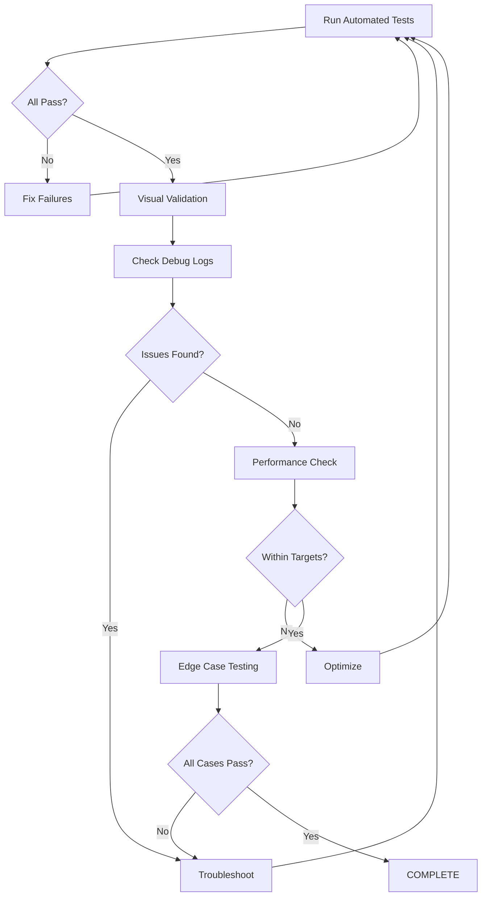

# Command Editor Testing & Validation Guide

**Purpose:** Comprehensive testing and validation procedures for the command editing system in CRACK Track TUI.

**Audience:** Developers testing command editor features, penetration testers validating UX flows.

**Last Updated:** 2025-10-11

---

## Table of Contents

1. [Quick Start](#quick-start)
2. [Automated Test Suite](#automated-test-suite)
3. [Visual Validation Checklist](#visual-validation-checklist)
4. [Debug Log Analysis](#debug-log-analysis)
5. [Edge Cases](#edge-cases)
6. [Performance Validation](#performance-validation)
7. [Troubleshooting](#troubleshooting)

---

## Quick Start

### Prerequisites

```bash
# 1. Ensure tests pass
pytest tests/track/interactive/test_command_editor_integration.py -v

# 2. Create test target profile
crack track --tui 192.168.45.100 --debug --debug-categories=UI.EDITOR:TRACE,STATE:VERBOSE

# 3. Import nmap scan with services
# (Or manually add tasks with commands for testing)
```

### 5-Minute Validation

**Fastest way to verify command editor works:**

1. Launch TUI: `crack track --tui 192.168.45.100`
2. Select task with gobuster command
3. Press `e` → Quick editor menu appears
4. Press `2` → Edit wordlist parameter
5. Enter new path → Diff preview shows changes
6. Press Enter → Command updated
7. Return to dashboard → Navigate back → Verify persistence

**Expected Result:** Command modified and saved successfully.

---

## Automated Test Suite

### Running Tests

```bash
# All command editor integration tests
pytest tests/track/interactive/test_command_editor_integration.py -v

# Specific test
pytest tests/track/interactive/test_command_editor_integration.py::test_quick_editor_wordlist_change -xvs

# With coverage
pytest tests/track/interactive/test_command_editor_integration.py \
  --cov=track.interactive.components.command_editor \
  --cov-report=term-missing

# Watch mode (rerun on file changes)
pytest-watch tests/track/interactive/test_command_editor_integration.py
```

### Test Coverage

| Test | Coverage | Purpose |
|------|----------|---------|
| `test_quick_editor_wordlist_change` | Quick edit flow | Edit parameter and save |
| `test_quick_editor_cancel_preserves_original` | Cancel behavior | Verify no changes on cancel |
| `test_escalation_quick_to_advanced` | Tier escalation | Quick → Advanced → Raw |
| `test_escalation_quick_to_raw` | Direct escalation | Quick → Raw (skip advanced) |
| `test_raw_editor_syntax_validation` | Validation | Invalid syntax detection |
| `test_edit_task_without_command_shows_error` | Error handling | Missing command error |
| `test_command_update_persists_after_edit` | Persistence | Changes saved to profile |
| `test_editor_launch_performance` | Performance | Launch timing documented |

**Coverage Target:** 90%+ for integration code paths

### Expected Test Results

```bash
========== test session starts ==========
tests/track/interactive/test_command_editor_integration.py::test_quick_editor_wordlist_change PASSED
tests/track/interactive/test_command_editor_integration.py::test_quick_editor_cancel_preserves_original PASSED
tests/track/interactive/test_command_editor_integration.py::test_escalation_quick_to_advanced PASSED
tests/track/interactive/test_command_editor_integration.py::test_escalation_quick_to_raw PASSED
tests/track/interactive/test_command_editor_integration.py::test_raw_editor_syntax_validation PASSED
tests/track/interactive/test_command_editor_integration.py::test_edit_task_without_command_shows_error PASSED
tests/track/interactive/test_command_editor_integration.py::test_command_update_persists_after_edit PASSED
tests/track/interactive/test_command_editor_integration.py::test_editor_launch_performance PASSED

========== 8 passed in 5.2s ==========
```

---

## Visual Validation Checklist

**Note:** Perform these tests AFTER automated tests pass. Visual validation ensures UX quality that logs alone cannot verify.

### Setup

```bash
# Terminal 1: Run TUI with debug logging
crack track --tui 192.168.45.100 --debug \
  --debug-categories=UI.EDITOR:TRACE,UI.EDITOR_TIER:VERBOSE,STATE.TRANSITION:VERBOSE

# Terminal 2: Monitor logs in real-time
tail -f .debug_logs/tui_debug_*.log | grep -E "\[UI.EDITOR|\[STATE.TRANSITION"
```

---

### User Story 1: Quick Edit Wordlist

**Scenario:** User wants to change wordlist from small to big.

**Task:** Gobuster directory enumeration
```bash
Command: gobuster dir -u http://192.168.45.100 -w /usr/share/wordlists/dirb/common.txt
```

**Steps:**

1. [ ] Navigate to task from dashboard (press number or `l` + filter)
2. [ ] Task Workspace panel displays with command visible
3. [ ] Press `e` → Quick editor launches
4. [ ] **Verify:** Editor header shows:
   ```
   📝 Edit Command
   Tool: gobuster
   Command: gobuster dir -u http://192.168.45.100 -w /usr/share/wordlists/dirb/common.txt
   Tip: Use 'a' to escalate to advanced editor, 'r' for raw editor, 'c' to cancel
   ```
5. [ ] **Verify:** Parameter menu displays:
   ```
   Editable Parameters
   #  Parameter    Current Value
   1  url          http://192.168.45.100
   2  wordlist     /usr/share/wordlists/dirb/common.txt
   3  threads      50
   4  extensions   <empty>
   5  output       <empty>
   ```
6. [ ] Press `2` to select wordlist
7. [ ] **Verify:** Prompt shows: `Enter new value for wordlist:`
8. [ ] Enter: `/usr/share/wordlists/dirb/big.txt`
9. [ ] **Verify:** Diff preview displays:
   ```diff
   - gobuster dir -u http://192.168.45.100 -w /usr/share/wordlists/dirb/common.txt
   + gobuster dir -u http://192.168.45.100 -w /usr/share/wordlists/dirb/big.txt
   ```
10. [ ] Press Enter to execute
11. [ ] **Verify:** Success message: `✓ Command updated successfully`
12. [ ] Task Workspace displays updated command
13. [ ] Press `b` to return to dashboard
14. [ ] Navigate back to same task
15. [ ] **Verify:** Modified command persists

**Expected Logs:**
```
[UI.INPUT] Key pressed: e
[STATE.TRANSITION] task_workspace -> COMMAND_EDITOR (edit command)
[UI.EDITOR] CommandEditor initialized (tool=gobuster)
[UI.EDITOR_TIER] Tier selected: quick (in_common_params=True)
[UI.EDITOR] Editor complete (iterations=1)
[STATE.TRANSITION] COMMAND_EDITOR -> task_workspace (command updated)
```

---

### User Story 2: Escalation to Advanced Editor

**Scenario:** User wants full control over nmap parameters using form-based editing.

**Task:** Nmap service detection scan
```bash
Command: nmap -sV -p 80,443 192.168.45.100
```

**Steps:**

1. [ ] Navigate to nmap task
2. [ ] Press `e` → Quick editor loads
3. [ ] Press `a` to escalate to advanced editor
4. [ ] **Verify:** Transition message shows: `Escalating to advanced editor...`
5. [ ] **Verify:** Warning displays (current implementation):
   ```
   ⚠ Advanced editor (schema-driven forms) coming soon!
   Escalating to raw text editor...
   ```
6. [ ] **Verify:** Auto-escalates to raw editor
7. [ ] **Verify:** Raw editor header shows:
   ```
   ✏ Raw Text Editor
   Edit command directly. Press Enter twice when done.
   ```
8. [ ] Raw editor displays current command with line numbers:
   ```
   1 | nmap -sV -p 80,443 192.168.45.100
   ```
9. [ ] Press Enter (empty line) to cancel
10. [ ] Returns to Task Workspace

**Expected Logs:**
```
[UI.EDITOR_TIER] Tier selected: quick
[UI.EDITOR_TIER] Tier escalation from_tier=quick to_tier=advanced (user requested)
[UI.EDITOR_TIER] Tier escalation from_tier=advanced to_tier=raw (schema placeholder)
[UI.EDITOR_TIER] Running tier: raw
```

**Note:** Once advanced editor is fully implemented, this test should verify:
- Schema-driven form displays
- All nmap parameters editable
- Boolean flags toggle correctly
- Enum fields show dropdown options

---

### User Story 3: Raw Editor with Syntax Validation

**Scenario:** User manually edits command but introduces syntax error.

**Task:** Gobuster directory enumeration

**Steps:**

1. [ ] Navigate to task
2. [ ] Press `e` → Quick editor loads
3. [ ] Press `r` to escalate directly to raw editor
4. [ ] **Verify:** Raw editor displays command with line numbers
5. [ ] **Verify:** Prompt shows: `Enter new command:`
6. [ ] Enter invalid command (unbalanced quotes):
   ```bash
   gobuster dir -u "http://192.168.45.100
   ```
7. [ ] Press Enter twice (empty line = done)
8. [ ] **Verify:** Validation runs automatically
9. [ ] **Verify:** Error displays:
   ```
   ✗ Validation errors:
   • Unbalanced quotes: Missing closing quote
   ```
10. [ ] **Verify:** Prompt shows: `Execute anyway? [y/N]`
11. [ ] Press `n` to decline
12. [ ] **Verify:** Returns to Task Workspace
13. [ ] **Verify:** Original command unchanged

**Expected Logs:**
```
[UI.EDITOR_TIER] Running tier: raw
[UI.EDITOR] Validation failed (errors=1)
[UI.EDITOR] Editor cancelled (user declined override)
[STATE.TRANSITION] COMMAND_EDITOR -> task_workspace
```

---

### User Story 4: Cancel Preserves Original

**Scenario:** User starts editing but changes mind.

**Task:** Any task with command

**Steps:**

1. [ ] Navigate to task
2. [ ] Note original command
3. [ ] Press `e` → Editor opens
4. [ ] **Start editing** (select parameter, enter new value)
5. [ ] Press `c` to cancel
6. [ ] **Verify:** Editor closes immediately
7. [ ] **Verify:** Message displays: `Cancelled`
8. [ ] **Verify:** Original command unchanged in Task Workspace
9. [ ] Return to dashboard and navigate back
10. [ ] **Verify:** Original command still present (no persistence)

**Expected Logs:**
```
[UI.EDITOR] CommandEditor initialized
[UI.EDITOR] Editor cancelled (tier=quick)
[STATE.TRANSITION] COMMAND_EDITOR -> task_workspace
```

---

### User Story 5: Task Without Command Error

**Scenario:** User tries to edit parent task (investigation/collection) with no command.

**Task:** Parent task (no command metadata)

**Steps:**

1. [ ] Navigate to parent task (e.g., "Port Discovery" parent node)
2. [ ] **Verify:** Task panel shows no command (displays "N/A" or empty)
3. [ ] Press `e` to attempt edit
4. [ ] **Verify:** Warning displays:
   ```
   ⚠ No command found for this task
   ```
5. [ ] **Verify:** Editor does NOT launch
6. [ ] **Verify:** Prompt shows: `Press Enter to continue...`
7. [ ] Press Enter → Returns to Task Workspace immediately

**Expected Logs:**
```
[UI.INPUT] Key pressed: e
[UI.EDITOR] Error: No command metadata found
[STATE.TRANSITION] task_workspace -> task_workspace (no change)
```

---

### User Story 6: Port Discovery Workflow (End-to-End)

**Scenario:** Complete workflow from dashboard to executing edited command.

**Reference:** As mentioned in user's question - "use `Dashboard > Task Workspace > Port Discovery` as a reference".

**Steps:**

1. [ ] **Dashboard:** Display shows available tasks
2. [ ] Navigate to "Port Discovery" task (or similar scan task)
3. [ ] **Task Workspace:** Panel displays task details:
   ```
   Dashboard > Task Workspace > Port Discovery

   Description: Initial port scan to discover services
   Command: nmap -p- --min-rate=5000 192.168.45.100
   Priority: HIGH | Time: ~5 min | nmap, discovery

   Actions:
   1. Execute this task
   2. Edit command
   3. View alternatives
   ```
4. [ ] Select option 2 (Edit command) OR press `e` hotkey
5. [ ] **Command Editor:** Quick editor displays:
   ```
   📝 Edit Command
   Tool: nmap

   Editable Parameters
   1  target     192.168.45.100
   2  ports      -
   3  timing     5
   4  output     <empty>
   ```
6. [ ] Edit parameter (e.g., change ports to specific range)
7. [ ] Press `2` → Enter: `1-1000`
8. [ ] **Verify:** Diff preview shows:
   ```diff
   - nmap -p- --min-rate=5000 192.168.45.100
   + nmap -p 1-1000 --min-rate=5000 192.168.45.100
   ```
9. [ ] Confirm execution
10. [ ] **Task Workspace:** Updated command displays
11. [ ] Select option 1 (Execute this task)
12. [ ] **I/O Panel:** Command executes with streaming output
13. [ ] **Verify:** Output shows nmap scanning ports 1-1000
14. [ ] After completion, task marked as completed

**Expected Outcome:**
- Seamless navigation through all panels
- Command editing integrated naturally
- Execution uses modified command
- Workflow feels intuitive and fast

---

## Debug Log Analysis

### Real-Time Monitoring

```bash
# Terminal 1: Run TUI
crack track --tui 192.168.45.100 --debug --debug-categories=UI.EDITOR:TRACE,STATE:VERBOSE

# Terminal 2: Watch logs (filtered)
tail -f .debug_logs/tui_debug_*.log | grep -E "\[UI.EDITOR|\[STATE.TRANSITION"

# Terminal 3: Watch for errors
tail -f .debug_logs/tui_debug_*.log | grep -i "error\|warning\|exception"
```

### Key Log Patterns

**Editor Launch:**
```
[UI.INPUT] Key pressed: e
[STATE.TRANSITION] task_workspace -> COMMAND_EDITOR (edit command)
[UI.EDITOR] CommandEditor initialized (command_length=78, tool=gobuster)
```

**Tier Selection:**
```
[UI.EDITOR_SCHEMA] Schema check for gobuster (exists=True, cached=False)
[UI.EDITOR_TIER] Tier selected: quick (in_common_params=True, has_schema=True)
[UI.EDITOR_TIER] Running tier: quick (command_length=78)
```

**Escalation:**
```
[UI.EDITOR_TIER] Tier escalation (from_tier=quick, to_tier=raw, reason=user requested)
[UI.EDITOR_TIER] Running tier: raw
```

**Completion:**
```
[UI.EDITOR] Editor complete (tier=quick, iterations=1)
[STATE.TRANSITION] COMMAND_EDITOR -> task_workspace (command updated)
```

**Cancellation:**
```
[UI.EDITOR] Editor cancelled (tier=quick)
[STATE.TRANSITION] COMMAND_EDITOR -> task_workspace
```

**Validation:**
```
[UI.EDITOR] Validation failed (errors=1, warnings=0)
[UI.EDITOR] User declined override
[UI.EDITOR] Editor cancelled
```

### Log Analysis Commands

```bash
# View last 50 editor-related logs
grep "\[UI.EDITOR" .debug_logs/tui_debug_*.log | tail -50

# Check tier transitions
grep "Tier" .debug_logs/tui_debug_*.log

# Find validation errors
grep -C 5 "Validation" .debug_logs/tui_debug_*.log

# Check state transitions
grep "\[STATE.TRANSITION" .debug_logs/tui_debug_*.log | tail -20

# Performance timing (if --debug-timing enabled)
grep "elapsed=" .debug_logs/tui_debug_*.log | grep EDITOR

# Find exceptions
grep -i "exception\|traceback" .debug_logs/tui_debug_*.log
```

---

## Edge Cases

### Long Commands (>100 characters)

**Test:**
```bash
Command: gobuster dir -u http://192.168.45.100/very/long/path/to/application -w /usr/share/wordlists/dirbuster/directory-list-2.3-medium.txt -t 100 -x php,html,txt,js,css -o output.txt
```

**Verify:**
- [ ] Command truncated in Task Workspace panel (shows first 70 chars + "...")
- [ ] Full command visible in editor
- [ ] Editing works correctly
- [ ] Diff preview handles long lines
- [ ] Saved command is complete (not truncated)

---

### Multi-Line Commands

**Test:**
```bash
Command: nmap -sV -sC \
  -p 80,443,8080 \
  --script=http-* \
  192.168.45.100
```

**Verify:**
- [ ] Quick editor parses multi-line correctly
- [ ] Raw editor displays with proper line numbers
- [ ] Backslash continuations preserved
- [ ] Editing doesn't break line continuations
- [ ] Saved command maintains formatting

---

### Special Characters

**Test:**
```bash
Command: curl -X POST 'http://192.168.45.100/search?q=test&page=1' -H 'User-Agent: Mozilla/5.0' -d 'param=value&other="quoted"'
```

**Verify:**
- [ ] Quotes preserved in parameter extraction
- [ ] Ampersands handled correctly
- [ ] URLs with query params parse correctly
- [ ] Header values with quotes work
- [ ] POST data parameters handled

---

### Missing Schema Fallback

**Test:** Use tool without schema (e.g., `ffuf`, `wfuzz`, `feroxbuster`)

**Command:**
```bash
ffuf -u http://192.168.45.100/FUZZ -w /usr/share/wordlists/dirb/common.txt
```

**Verify:**
- [ ] Editor starts (doesn't crash)
- [ ] Automatically escalates to raw editor
- [ ] Log shows: "Tier selected: raw (no schema found)"
- [ ] Raw editor works correctly
- [ ] Command editable as text

---

### Exception Handling

**Test:** Simulate editor crash

**Method:** (Requires code modification for testing)
```python
# Temporarily add to quick_editor.py run() method
raise RuntimeError("Simulated editor crash")
```

**Verify:**
- [ ] TUI doesn't freeze
- [ ] Error message displayed
- [ ] Log shows exception details
- [ ] Returns to Task Workspace gracefully
- [ ] Profile not corrupted

---

## Performance Validation

### Timing Benchmarks

**Expected Performance:**

| Operation | Target | Acceptable | Failure |
|-----------|--------|------------|---------|
| Editor launch | <100ms | <200ms | >500ms |
| Tier transition | <50ms | <100ms | >300ms |
| Schema load (uncached) | <20ms | <50ms | >100ms |
| Schema load (cached) | <5ms | <10ms | >50ms |
| Command rebuild | <10ms | <30ms | >100ms |
| Profile save | <50ms | <100ms | >300ms |

### Performance Testing

```bash
# Enable timing logs
crack track --tui 192.168.45.100 --debug --debug-timing \
  --debug-categories=UI.EDITOR:TRACE,PERFORMANCE:VERBOSE

# Perform editing workflow

# Analyze timing
grep "elapsed=" .debug_logs/tui_debug_*.log | grep EDITOR

# Expected output:
# [PERFORMANCE] Editor launch elapsed=0.085s
# [PERFORMANCE] Tier selection elapsed=0.012s
# [PERFORMANCE] Schema load elapsed=0.008s (cached)
# [PERFORMANCE] Command rebuild elapsed=0.005s
```

### Performance Issues

**Slow editor launch (>500ms):**
- Check for blocking I/O (schema file reads)
- Verify schema caching works
- Profile code with cProfile

**Slow tier transitions (>300ms):**
- Check for redundant parsing
- Verify command state not re-parsed unnecessarily
- Profile tier switching code

**Memory leaks:**
```bash
# Monitor memory during extended editing session
ps aux | grep "crack track" | awk '{print $6}'

# Memory should stabilize, not continuously grow
```

---

## Troubleshooting

### Editor Not Launching

**Symptoms:**
- Press `e`, nothing happens
- Warning: "No command found"
- TUI freezes

**Debug Steps:**

1. **Check task metadata:**
   ```bash
   # View profile JSON
   cat ~/.crack/targets/192.168.45.100.json | jq '.tasks[] | select(.id=="task-id") | .metadata.command'
   ```

2. **Check logs:**
   ```bash
   grep "Edit command" .debug_logs/tui_debug_*.log
   grep "No command" .debug_logs/tui_debug_*.log
   ```

3. **Verify hotkey registered:**
   ```bash
   grep "hotkey.*e" .debug_logs/tui_debug_*.log
   ```

**Common Causes:**
- Task has no `command` key in metadata (expected for parent tasks)
- Hotkey shadowed by higher-priority handler
- Input handler not processing `e` key

---

### Command Not Saving

**Symptoms:**
- Edit appears successful
- Return to task shows original command
- No error messages

**Debug Steps:**

1. **Check save confirmation:**
   ```bash
   grep "command updated" .debug_logs/tui_debug_*.log
   grep "Profile saved" .debug_logs/tui_debug_*.log
   ```

2. **Verify profile modification:**
   ```bash
   # Check profile timestamp
   stat ~/.crack/targets/192.168.45.100.json

   # View task command
   cat ~/.crack/targets/192.168.45.100.json | jq '.tasks[] | select(.id=="task-id").metadata.command'
   ```

3. **Check EditResult action:**
   ```bash
   grep "EditResult.*action" .debug_logs/tui_debug_*.log
   ```

**Common Causes:**
- EditResult action is "cancel" instead of "execute"
- Profile not saved after metadata update
- File permissions prevent write
- Concurrent access conflict

---

### Validation Errors

**Symptoms:**
- Command appears valid
- Validation fails with false positive
- Cannot execute command

**Debug Steps:**

1. **Check validation logic:**
   ```bash
   grep "Validation" .debug_logs/tui_debug_*.log
   ```

2. **Test command manually:**
   ```bash
   # Copy command from editor
   # Run in shell to verify it's actually valid
   gobuster dir -u "http://target" -w /path/to/wordlist
   ```

3. **Review CommandValidator code:**
   ```bash
   # Check for overly strict validation
   cat track/interactive/components/command_editor/validator.py
   ```

**Common Causes:**
- Validator doesn't handle edge case (multi-line, special chars)
- Regex too strict
- Path validation fails for valid paths (symlinks, NFS mounts)

---

### Tier Escalation Issues

**Symptoms:**
- Press `a` or `r`, nothing happens
- Escalation loops infinitely
- Wrong tier displayed

**Debug Steps:**

1. **Check escalation logs:**
   ```bash
   grep "escalation" .debug_logs/tui_debug_*.log
   ```

2. **Check tier routing:**
   ```bash
   grep "Tier selected" .debug_logs/tui_debug_*.log
   grep "Running tier" .debug_logs/tui_debug_*.log
   ```

3. **Verify max iterations not reached:**
   ```bash
   grep "Max iterations" .debug_logs/tui_debug_*.log
   ```

**Common Causes:**
- Tier returns `EditResult` with `action="escalate"` but invalid `next_tier`
- Circular escalation (Advanced → Raw → Advanced)
- Editor hits max iterations (10) due to loop

---

## Summary

### Testing Workflow



### Completion Checklist

**Before Release:**

- [ ] All 8 automated tests passing
- [ ] All 6 user stories validated visually
- [ ] Debug logs show no errors/warnings
- [ ] Performance within targets (<500ms operations)
- [ ] Edge cases handled correctly
- [ ] Documentation updated
- [ ] User notified of completion

### Next Steps

1. **Run automated tests**: `pytest tests/track/interactive/test_command_editor_integration.py -v`
2. **Perform visual validation**: Follow User Story checklists above
3. **Monitor debug logs**: Check for unexpected errors
4. **Test edge cases**: Long commands, special chars, etc.
5. **Validate performance**: Check timing logs
6. **Report results**: Document any issues found

---

## References

- **Implementation:** `track/interactive/components/command_editor/`
- **Integration:** `track/interactive/tui_session_v2.py` (lines 852-905)
- **Tests:** `tests/track/interactive/test_command_editor_integration.py`
- **Checklist:** `track/docs/CMD_PANEL_CHECKLIST.md`
- **CLAUDE.md:** `OSCP/crack/CLAUDE.md` (TUI Debug-Validation Test Pattern)

---

**Document Status:** ✅ Complete
**Last Validated:** 2025-10-11
**Maintainer:** CRACK Track Development Team
